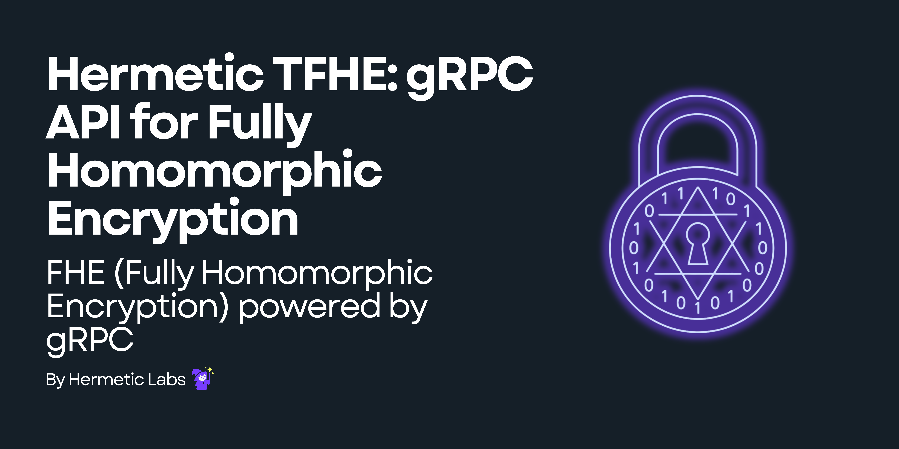

[](https://www.rust-lang.org/)
[](https://www.postgresql.org/)
[](https://github.com/Hermetic-Labs/hermetic-mls/blob/main/LICENSE)
[](https://grpc.io/)
[](https://buf.build/hermetic-labs/hermetic-mls)


# hermetic-fhe 🔢: gRPC fully homomorphic encryption service

A gRPC API for Fully Homomorphic Encryption using [Zama's](https://www.zama.ai/) [TFHE-rs](https://github.com/zama-ai/tfhe-rs) library.

## Overview

This project provides a gRPC service that enables secure computation on encrypted data using Fully Homomorphic Encryption (FHE). It's built using:

- [Tonic](https://github.com/hyperium/tonic) - A Rust implementation of gRPC
- [TFHE-rs](https://github.com/zama-ai/tfhe-rs) - A Pure Rust implementation of the TFHE scheme for boolean and integer arithmetics

## Features

- Key generation with configurable security parameters
- Encryption/decryption of boolean and integer values
- Homomorphic operations on encrypted data:
  - Boolean operations: AND, OR, XOR, NOT
  - Integer operations: Addition, Subtraction, Multiplication

## Project Structure

```
hermetic-fhe/
├── proto/                 # Protocol Buffer definitions
│   └── fhe_service.proto  # gRPC service definition
├── src/
│   ├── api/               # Generated gRPC code and API exports
│   │   └── mod.rs
│   ├── crypto/            # TFHE-rs integration
│   │   └── mod.rs
│   ├── service/           # Service implementation
│   │   ├── fhe_service.rs # Implementation of the gRPC service
│   │   └── mod.rs
│   ├── bin/               # Binary executables
│   │   └── client.rs      # Example client
│   └── main.rs            # Server entry point
├── tests/                 # Test suite
│   ├── crypto_test.rs     # Unit tests for crypto functionality
│   ├── service_test.rs    # Integration tests for service functionality
│   ├── integer_test.rs    # Tests for integer operations
│   └── error_handling_test.rs # Tests for error handling
├── build.rs               # Build script for Protocol Buffer compilation
├── Cargo.toml             # Rust dependencies
└── README.md              # This file
```

## Building and Running

### Prerequisites

1. Rust toolchain (1.75+)
2. Protobuf compiler (`protoc`)

### Installation

1. Clone the repository:
   ```
   git clone https://github.com/yourusername/hermetic-fhe.git
   cd hermetic-fhe
   ```

2. Build the project:
   ```
   cargo build
   ```

### Running the Server

```
cargo run
```

This will start the FHE service on `[::1]:50051`.

### Running the Example Client

In a separate terminal:

```
cargo run --bin client
```

This will:
1. Connect to the FHE service
2. Generate encryption keys
3. Encrypt boolean values
4. Perform a homomorphic AND operation
5. Decrypt and display the result

### Running Tests

The project includes comprehensive test suites to verify the functionality of the FHE service:

```
cargo test
```

This will run all tests, including:
- Unit tests for cryptographic operations
- Integration tests for the gRPC service
- Tests for boolean and integer operations
- Error handling tests

To run a specific test file:

```
cargo test --test <test_file_name>
```

For example:
```
cargo test --test crypto_test
cargo test --test service_test
cargo test --test integer_test
cargo test --test error_handling_test
```

## API Documentation

### Key Generation

Generate a client key (for encryption/decryption) and server key (for homomorphic operations).

### Encryption

Encrypt boolean or integer values using the client key.

### Evaluation

Perform operations on encrypted data without decrypting it:
- Boolean operations: AND, OR, XOR, NOT
- Integer operations: Addition, Subtraction, Multiplication

### Decryption

Decrypt the results using the client key.

## Security Considerations

- Client keys should be kept private and secure
- Server keys can be public and are used for homomorphic operations
- This implementation stores keys and ciphertexts in memory for demonstration purposes
- In a production environment, you would need proper key management and persistence

## License

AGPL v3

## Contributing

Contributions are welcome! Please feel free to submit a Pull Request.
